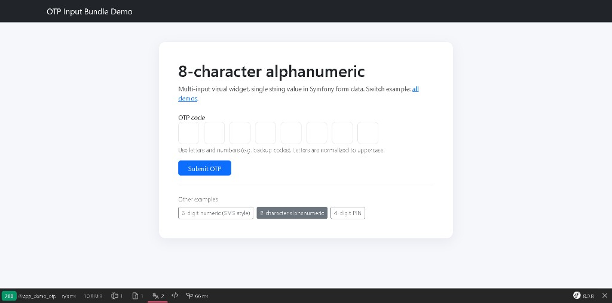

# Barcode Input Bundle

[](https://github.com/nowo-tech/BarcodeInputBundle/actions/workflows/ci.yml) [](https://packagist.org/packages/nowo-tech/barcode-input-bundle) [](https://packagist.org/packages/nowo-tech/barcode-input-bundle) [](LICENSE) [](https://php.net) [](https://symfony.com)

> Star **Found this useful?** Install it from Packagist and support the project on GitHub.

Symfony `FormType` for barcode capture with optional camera scanning (ZXing) and hardware wedge scanner support.


This bundle is **FrankenPHP worker mode friendly**.

## Table of contents

- [Features](#features)
- [Quick usage](#quick-usage)
- [Demo preview](#demo-preview)
- [Documentation](#documentation)
- [Tests and coverage](#tests-and-coverage)
- [License](#license)

## Features

- `BarcodeType::class` for product codes, warehouse labels, inventory scans.
- Optional camera scanner button powered by `@zxing/browser`.
- Compatible with USB/Bluetooth keyboard-wedge barcode scanners.
- Normalizes whitespace and non-printable characters server-side.
- TypeScript + Vite assets in `src/Resources/assets` (named package `nowo_barcode_input`).
- Translations **de, en, es, fr, it, nl, pt**.
- Multi-framework Twig themes (Bootstrap, Tailwind, Foundation, Symfony default).

## Quick usage

```php
use Nowo\BarcodeInputBundle\Form\BarcodeType;

$builder->add('barcode', BarcodeType::class, [
    'enable_scanner' => true,
    'max_length' => 13,
    'formats' => ['ean_13', 'ean_8', 'upc_a'],
    'container_class' => 'nowo-barcode-input__container',
    'input_class' => 'form-control',
    'button_class' => 'btn btn-outline-secondary',
]);
```

The value received in `barcode` is a single normalized string, for example `40170725`.

## Demo preview



## Documentation

- [GitHub Actions CI requirements](docs/GITHUB_CI.md)
- [Installation](docs/INSTALLATION.md)
- [Configuration](docs/CONFIGURATION.md)
- [PSR evaluation (REQ-CS-007)](docs/PSR.md)
- [Usage](docs/USAGE.md)
- [Contributing](docs/CONTRIBUTING.md)
- [Code of Conduct](CODE_OF_CONDUCT.md)
- [Changelog](docs/CHANGELOG.md)
- [Upgrading](docs/UPGRADING.md)
- [Release](docs/RELEASE.md)
- [Security](docs/SECURITY.md)
- [Engram](docs/ENGRAM.md)
- [Spec-driven development](docs/SPEC-DRIVEN-DEVELOPMENT.md)
- [GitHub Spec Kit](docs/SPEC-KIT.md)

### Additional documentation

- [Demo notes](docs/DEMO-FRANKENPHP.md)

## Tests and coverage

- PHP: 100%
- TS/JS: 100%
- Python: N/A

## License

This bundle is released under the [MIT License](LICENSE).
